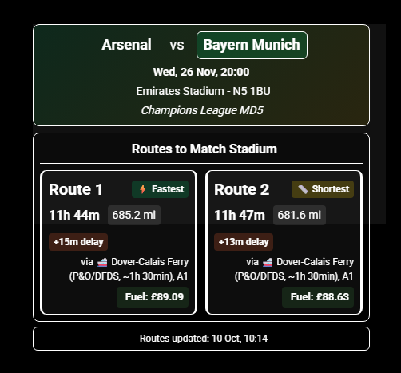
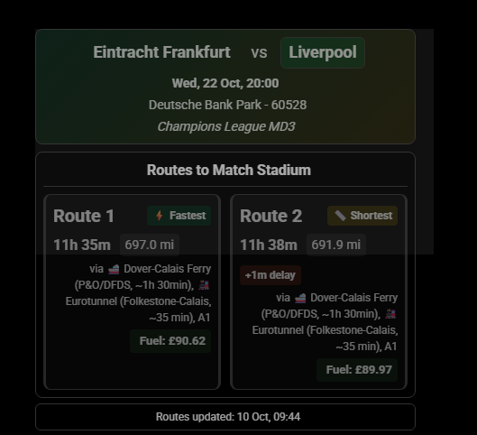
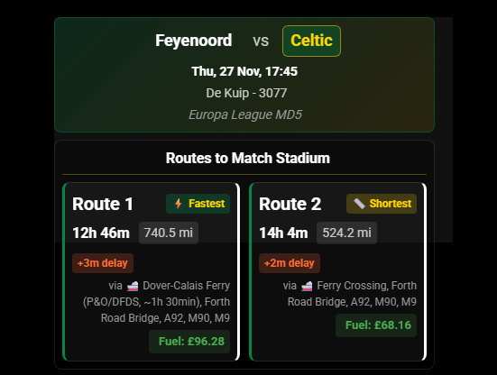
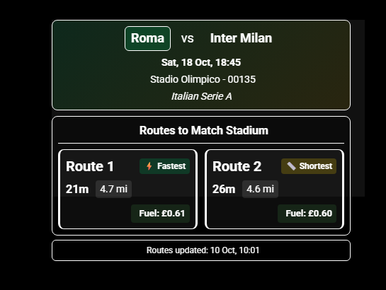

# MMM-MyTeams-DriveToMatch

**Author:** gitgitaway

Automatic fixture detection with real-time traffic routes to match venues using TomTom API and TheSportsDB/FootballWebPages. Supports all football teams and leagues (domestic and European competitions).

## ✨ Features

- 🎯 **Automatic Fixture Detection** - Shows your next match
- 🚗 **Real-time Traffic Routes** - Fastest and shortest routes with live traffic data
- 🌍 **9 Languages** - English, Spanish, French, German, Italian, Dutch, Portuguese, Scottish Gaelic, Irish Gaelic
- 🏟️ **161 Stadium Database** - Teams across 26 countries
- 🌉 **110+ Bridge Detection** - GPS-based waypoint detection across UK and Europe
- 🚢 **Ferry Detection** - Automatic ferry route detection for European fixtures
- 🛣️ **Major Waypoints** - Motorways, A-roads, bridges, and landmarks
- 💾 **Save Routes** - Click badge to save routes with turn-by-turn directions
- 🛣️ **Toll Avoidance** - Optional route planning to avoid toll roads
- ⛽ **Fuel Cost Estimation** - Estimated fuel costs per route
- 🧪 **Date Testing** - Override date for testing specific fixtures
- 🎨 **Customizable Styling** - Team-themed styling and color overrides

## 📚 Documentation

| Document | Purpose |
|----------|---------|
| **[CONFIGURATION.md](CONFIGURATION.md)** | All configuration options with examples |
| **[ROUTES.md](ROUTES.md)** | Saving routes with turn-by-turn directions |
| **[WAYPOINTS.md](WAYPOINTS.md)** | Bridge detection, ferries, and waypoints |
| **[REQUEST-MANAGER.md](REQUEST-MANAGER.md)** | Shared request manager for multi-module setup |
| **[TROUBLESHOOTING.md](usefull_Info/TROUBLESHOOTING.md)** | Common issues and solutions |
| **[CHANGELOG.md](CHANGELOG.md)** | Version history and changes |

## 🎬 Screenshots

*Examples show away fixture routes (also calculates home stadium routes)*

| Route | Description |
|-------|-------------|
|  | Arsenal v Bayern Munich |
|  | Eintracht Frankfurt v Liverpool |
|  | Feyenoord v Celtic |
|  | Roma v Inter Milan |

## 🚀 Quick Start

### 1. Installation

```bash
# Navigate to MagicMirror modules
cd ~/MagicMirror/modules

# Clone repository
git clone https://github.com/gitgitaway/MMM-MyTeams-DriveToMatch

# Install dependencies
cd MMM-MyTeams-DriveToMatch
npm install
```

### 2. Get API Keys

- **TomTom**: Visit [TomTom Developer Portal](https://developer.tomtom.com), create account, generate API key
- **TheSportsDB**: Free API (no key required for basic usage)

### 3. Minimal Configuration

Add to `config/config.js`:

```javascript
{
    module: "MMM-MyTeams-DriveToMatch",
    position: "top_right",
    config: {
        apiTomTomKey: "YOUR_TOMTOM_API_KEY",
        homeLatitude: 57.35066,        // Your home latitude
        homeLongitude: -3.59404,       // Your home longitude
        teamName: "Celtic"             // Your team name
    }
}
```

**To find your coordinates:**
- Go to [Google Maps](https://maps.google.com)
- Right-click your home location
- Use the latitude/longitude shown

### 4. Restart MagicMirror

```bash
# Full restart recommended
pm2 restart MagicMirror
```

## ⚙️ Configuration

See **[CONFIGURATION.md](CONFIGURATION.md)** for complete option reference.

**Quick Examples:**

```javascript
// Test European fixture by date
config: {
    dateOverride: "2025-11-27",  // Feyenoord vs Celtic
    debug: true
}

// Performance tuning
config: {
    fixturesCacheTTL: 60 * 60 * 1000,  // 1 hour cache
    routeUpdateInterval: 30 * 60 * 1000  // 30 min updates
}

// Custom styling
config: {
    darkMode: true,
    fontColorOverride: "#00FF41",   // Green text
    borderColorOverride: "#FFD700"  // Gold borders
}
```

## 🏟️ Supported Teams

Database includes **500+ teams** across **26 countries**:

- **Scotland**: 44 teams (all professional leagues)
- **England**: 51 teams (Premier League + Championship)
- **Major European Leagues**: Spain, Italy, Germany, France, Portugal, Netherlands, Belgium, Austria, Turkey, and 16 more countries

To add missing teams, see **[DATABASE.md](DATABASE.md)**.

## 📁 Saving Routes

Click the route badge (⚡ Fastest or 📏 Shortest) to save routes with complete turn-by-turn navigation.

Saved files include:
- Match details
- Route distance/duration/costs
- Turn-by-turn directions
- Major waypoints (bridges, motorways)
- GPS coordinates
- Traffic information

See **[ROUTES.md](ROUTES.md)** for complete guide.

## 🌉 Waypoints & Bridges

Module automatically detects:
- **110+ bridges** (UK and European)
- **Ferry crossings** (Scottish routes, European ferries)
- **Eurotunnel** (France-UK crossing)
- **Major highways** (motorways and A-roads)

GPS-based detection works even if TomTom doesn't mention bridges.

See **[WAYPOINTS.md](WAYPOINTS.md)** for details.

## 🔄 Multi-Module Setup

If using other MMM-MyTeams modules (Fixtures, LeagueTable, Honours), copy `shared-request-manager.js` to coordinate API requests:

```bash
# Copy to other modules
cp shared-request-manager.js ../MMM-MyTeams-Fixtures/
cp shared-request-manager.js ../MMM-MyTeams-LeagueTable/
cp shared-request-manager.js ../MMM-MyTeams-Honours/
```

This prevents rate limiting and timeouts. See **[REQUEST-MANAGER.md](REQUEST-MANAGER.md)** for details.

## 💾 Caching System

Module includes intelligent dual-cache system:

- **Stadium Cache**: Pre-parses database for 20x faster startup
- **Fixture Cache**: Caches next fixture + routes (5-min TTL by default)
- **Shared Cache**: Optional integration with MMM-MyTeams-Fixtures

Auto-invalidates when files change. Safe to delete cache files - rebuilds on startup.

## 🌐 Multi-Language Support

Automatic detection of MagicMirror language setting.

**Supported:** English, Spanish, French, German, Italian, Dutch, Portuguese, Scottish Gaelic, Irish Gaelic

Set in `config/config.js`:
```javascript
language: "en"  // Change to es, fr, de, it, nl, pt, gd, ga
```

## 🐛 Troubleshooting

Common issues quick reference:

| Issue | Solution |
|-------|----------|
| No routes showing | Verify TomTom API key, home coordinates, venue in database |
| Fixture not found | Check team name spelling, enable `debug: true` |
| European fixtures missing | Update to latest version, verify UEFA league IDs |
| Bridges not showing | Enable `debug: true`, check route passes close to bridges |
| Cache issues | Delete cache files and restart MagicMirror |

For detailed troubleshooting, see **[TROUBLESHOOTING.md](usefull_Info/TROUBLESHOOTING.md)**.

Enable debug mode in config:
```javascript
config: {
    debug: true  // See detailed console logs
}
```

## API Limits

- **TheSportsDB**: Reasonable usage for personal use
- **TomTom**: Free tier = 2,500 requests/day

See caching configuration to optimize API usage.

## 📋 Version Information

| Version | Status | Date |
|---------|--------|------|
| v1.4.3 | Latest | 2025-10-15 |
| v1.4.2 | Stable | 2025-10-xx  |
| v1.4.1 | Archive | 2025-10-XX |
| v1.4.0 | Archive | 2025-10-02 |

See **[CHANGELOG.md](CHANGELOG.md)** for complete version history.

## 🎓 Credits

- **TheSportsDB**: Fixture data API
- **FootballWebPages**: Fixture backup data
- **TomTom**: Routing and traffic API
- **MagicMirror²**: Smart mirror platform

## 📝 Notes

This is the 6th module in a Celtic-themed MagicMirror setup. Other modules:

- [MMM-MyTeams-Clock](https://github.com/gitgitaway/MMM-MyTeams-Clock)
- [MMM-MyTeams-LeagueTable](https://github.com/gitgitaway/MMM-MyTeams-LeagueTable)
- [MMM-MyTeams-Fixtures](https://github.com/gitgitaway/MMM-MyTeams-Fixtures)
- [MMM-JukeBox](https://github.com/gitgitaway/MMM-JukeBox)
- [MMM-MyTeams-Honours](https://github.com/gitgitaway/MMM-MyTeams-Honours)
- [MMM-MyTeams-DriveToMatch](https://github.com/gitgitaway/MMM-MyTeams-DriveToMatch)

## 📖 Getting Help

1. **Check Documentation**: Most answers in linked docs above
2. **Enable Debug Mode**: `debug: true` shows detailed console logs
3. **Review Troubleshooting**: Common issues already documented
4. **Check CHANGELOG**: Version-specific information
5. **Console Logs**: Use browser dev tools (F12) to see detailed errors

---


**For complete guides, see documentation links at top of README.**

