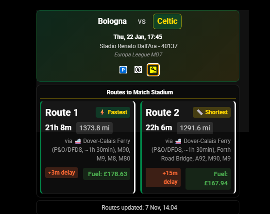
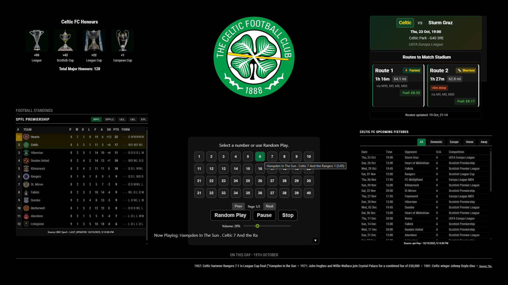

# MMM-MyTeams-DriveToMatch

**Author:** gitgitaway
**Version** v 1.5.1

Automatic fixture detection with real-time traffic routes to match venues using [TomTom API](https://developer.tomtom.com/user/me/apps) , [TheSportsDB](https://www.thesportsdb.com/) & [FootballWebPages](https://www.footballwebpages.co.uk/). Supports all football teams and leagues (world wide domestic and European competitions).

## 🎬 Screenshots

*Examples show away fixture routes (also calculates home stadium routes)*

| Route | Description |
|-------|-------------|
|  | Arsenal v Bayern Munich |
|  | Eintracht Frankfurt v Liverpool |
|  | Feyenoord v Celtic |
|  | Roma v Inter Milan |
|  | Parking, Charging & Airport Icons |

## ✨ Features

### Core Features
- 🎯 **Automatic Fixture Detection** - Shows your next match
- 🚗 **Real-time Traffic Routes** - Fastest and shortest routes with live traffic data
- 🌍 **9 Languages** - English, Spanish, French, German, Italian, Dutch, Portuguese, Scottish Gaelic, Irish Gaelic
- 🏟️ **500+ Stadium Database** - Teams across 26 countries
- 🌉 **110+ Bridge Detection** - GPS-based waypoint detection across UK and Europe
- 🚢 **Ferry Detection** - Automatic ferry route detection for European fixtures
- 🛣️ **Major Waypoints** - Motorways, A-roads, bridges, and landmarks
- 💾 **Save Routes** - Click badge to save routes with turn-by-turn directions
- 🛣️ **Toll Avoidance** - Optional route planning to avoid toll roads
- ⛽ **Fuel Cost Estimation** - Estimated fuel costs per route
- 🧪 **Date Testing** - Override date for testing specific fixtures
- 🎨 **Customizable Styling** - Team-themed styling and color overrides

### Match Information Features
- 🅿️ **Parking Finder** - Find nearby parking with interactive maps
- ⚡ **EV Charging Stations** - Locate electric vehicle charging points
- ✈️ **Airport Finder** - Discover nearby airports for away fixtures (smart hide option for nearby venues)
- 🖨️ **Print Functionality** - Print all information sheets directly from browser
- 🎨 **Improved Icon Visibility** - Professional PNG icons (15×15px) with minimal design for compact display

## 📚 Documentation

### Essential Guides

| Document | Purpose |
|----------|---------|
| **[CONFIGURATION.md](documentation/CONFIGURATION.md)** | ⚙️ All configuration options with examples (minimum + full setup) |
| **[HOW_ IT_WORKS.md](documentation/HOW_IT_WORKS.md)** | ⚙️ Overview of how the module works |
| **[API_PRIORITY_GUIDE.md](documentation/API_PRIORITY_GUIDE.md)** | 🔄 Complete fixture lookup system with ASCII flowchart + 4 scenarios |
| **[OFFICIAL_WEBSITE_FALLBACK_GUIDE.md](documentation/OFFICIAL_WEBSITE_FALLBACK_GUIDE.md)** | 🌐 How to enable fallback for non-major league teams |
| **[STADIUM_UPDATE_NOTIFICATION_GUIDE.md](documentation/STADIUM_UPDATE_NOTIFICATION_GUIDE.md)** | 📲 Stadium database update system explanation |

### Feature Guides

| Document | Purpose |
|----------|---------|
| **[ROUTES.md](documentation/ROUTES.md)** | 📍 Saving routes with turn-by-turn directions |
| **[WAYPOINTS.md](documentation/WAYPOINTS.md)** | 🌉 Bridge detection, ferries, and waypoints |
| **[NEUTRAL_VENUE_QUICK_START.md](documentation/NEUTRAL_VENUE_QUICK_START.md)** | ⚽ Setting up neutral venue overrides for cup finals |
| **[PCA_ICONS_FEATURE_README.md](documentation/PCA%20_ICONS_FEATURES_README.md)** | 🅿️ ⚡ ✈️ Parking, Charging, and Airport information sheets with print functionality |

### Data Quality Tools

| Tool | Purpose |
|------|---------|
| **[STADIUM_VERIFICATION_USER_GUIDE.md](documentation/STADIUM_VERIFICATION_USER_GUIDE.md)** | 🏟️ Complete guide to stadium coordinate verification and correction script (located in `tools/`) |
| **[STADIUM-VERIFICATION_QUICK_REFERENCE.md](documentation/STADIUM-VERIFICATION_QUICK_REFERENCE.md)** | ⚡ Quick command reference for stadium verification script |

### Reference & Support

| Document | Purpose |
|----------|---------|
| **[DATABASE.md](documentation/DATABASE.md)** | 🏟️ Managing stadium database and adding teams |
| **[SHARED_REQUEST_MANAGER.md](documentation/SHARED_REQUEST_MANAGER.md)** | 📡 Shared request manager for multi-module setup |
| **[TROUBLESHOOTING.md](documentation/TROUBLESHOOTING.md)** | 🐛 Common issues and solutions |
| **[CHANGELOG.md](CHANGELOG.md)** | 📝 Version history and changes |


## 🚀 Quick Start

### 1. Installation

```bash
# Navigate to MagicMirror modules
cd ~/MagicMirror/modules

```
```bash
# Clone repository
git clone https://github.com/gitgitaway/MMM-MyTeams-DriveToMatch

```
```bash
# Install dependencies
cd MMM-MyTeams-DriveToMatch
npm install
```

### 2. Get API Keys

- **TomTom**: Visit [TomTom Developer Portal](https://developer.tomtom.com), create account, generate API key
- **TheSportsDB**: Free API (no key required for basic usage)

### 3. Minimal Configuration

Add to `config/config.js` - **Only 4 required settings!**

```javascript
{
    module: "MMM-MyTeams-DriveToMatch",
    position: "top_right",
    config: {
        apiTomTomKey: "YOUR_TOMTOM_API_KEY",    // Get from https://developer.tomtom.com
        homeLatitude: 57.35066,                 // Your home latitude
        homeLongitude: -3.59404,                // Your home longitude
        teamName: "Celtic"                      // Your team name
    }
}
```

**To find your coordinates:**
- Go to [Google Maps](https://maps.google.com)
- Right-click your home location
- Use the latitude/longitude shown

---

### 4. Full Configuration (All Features)

For advanced features and customization:

```javascript
{
    module: "MMM-MyTeams-DriveToMatch",
    position: "top_right",
    config: {
        // ===== REQUIRED =====
        apiTomTomKey: "YOUR_TOMTOM_API_KEY",
        homeLatitude: 57.35066,
        homeLongitude: -3.59404,
        
        // ===== TEAM =====
        teamName: "Celtic",
        teamId: "133647",  // TheSportsDB ID (auto-resolved if blank)
        
        // ===== FIXTURES & DATA =====
        season: "auto",                                    // Auto-detect current season
        fallbackSeason: "2025-2026",                      // Fallback if auto-detection fails
        leagueIds: ["4330", "4364", "4363", "4888"],    // Scottish leagues
        uefaLeagueIds: ["4480", "4481", "5071"],         // UEFA competitions
        useSearchEventsFallback: true,                    // Fallback to search events
        strictLeagueFiltering: true,                      // Filter by league IDs
        useSharedFixturesCache: false,                    // Share cache with other MMM-MyTeams modules
        
        // ===== MULTI-API (Advanced) =====
        useMultiAPIProvider: false,                       // Enable ESPN/BBC Sport fallback
        apiPriority: ["thesportsdb", "espn", "bbcsport"], // API priority order
        mergeFixtures: false,                             // Merge from all sources
        
        // ===== OFFICIAL WEBSITE FALLBACK =====
        useOfficialWebsiteFallback: false,               // For non-major league teams
        officialWebsiteFixtureUrl: "",                    // Club fixture URL
        
        // ===== UPDATE INTERVALS =====
        fixtureUpdateInterval: 24 * 60 * 60 * 1000,      // 24 hours
        routeUpdateInterval: 10 * 60 * 1000,             // 10 minutes
        
        // ===== DISPLAY =====
        showDelay: true,                                  // Show traffic delays
        showWaypoints: true,                              // Show bridges, ferries
        maxRoutes: 2,                                     // 1 (fastest) or 2 (fastest + shortest)
        units: "imperial",                                // "imperial" (miles) or "metric" (km)
        
        // ===== ROUTE FEATURES =====
        showEurotunnel: true,                            // Detect Eurotunnel
        showFerryDetails: true,                          // Show ferry info
        avoidTolls: false,                               // Avoid tolls
        
        // ===== FUEL COST =====
        showFuelCost: true,                              // Calculate fuel cost
        fuelEfficiency: 8.0,                             // L/100km (8.0 ≈ 35 MPG)
        fuelPricePerLitre: 1.45,                         // £1.45 GBP
        
        // ===== API SETTINGS =====
        requestTimeout: 20000,                           // 20 second timeout
        maxRetries: 3,                                   // Retry 3 times
        
        // ===== DEBUG & TESTING =====
        debug: false,                                     // Console logging
        dateOverride: null,                              // Test: "2025-11-27"
        
        // ===== STADIUM UPDATES =====
        enableStadiumUpdateNotification: true,           // Show update button
        
        // ===== POI DISPLAY OPTIONS =====
        hideAirportIfNearby: false,                     // Hide airport icon if home < 300 miles from venue
        airportProximityMiles: 300,                     // Threshold distance in miles for hiding airport icon
        
        // ===== THEME =====
        darkMode: null,                                  // null=auto, true=dark, false=light
        fontColorOverride: null,                         // "#FFFFFF", "#00FF41"
        borderColorOverride: null,                       // "#FFD700"
        opacityOverride: null,                           // 0.8 (0.0-1.0)
        
        // ===== NEUTRAL VENUES =====
        neutralVenueOverrides: {
            enabled: false,
            matches: [
                // { date: "2025-11-02", opponent: "Rangers", venue: "Hampden Park" }
            ]
        }
    }
}
```

---

### 5. Restart MagicMirror

```bash
# Full restart recommended
pm2 restart MagicMirror
```

---

## ⚙️ Complete Configuration Reference

See **[CONFIGURATION.md](documentation/CONFIGURATION.md)** for:
- Detailed explanation of every option
- All possible values and defaults
- Real-world examples for different scenarios
- How to find league IDs for your team
- Troubleshooting configuration issues

---

## 🔧 Configuration Examples

### Example 1: Basic Scottish Team

```javascript
config: {
    apiTomTomKey: "YOUR_TOMTOM_API_KEY",
    homeLatitude: 57.35066,
    homeLongitude: -3.59404,
    teamName: "Celtic"
}
```

### Example 2: Non-Major League Team (with Official Website Fallback)

```javascript
config: {
    apiTomTomKey: "YOUR_TOMTOM_API_KEY",
    homeLatitude: 57.35066,
    homeLongitude: -3.59404,
    teamName: "My Local Team",
    
    // Enable website scraping for non-major teams
    useOfficialWebsiteFallback: true,
    officialWebsiteFixtureUrl: "https://www.mylocalteam.com/fixtures/",
    
    // See OFFICIAL_WEBSITE_FALLBACK_GUIDE.md
}
```

### Example 3: Multi-League Support (with Multiple APIs)

```javascript
config: {
    apiTomTomKey: "YOUR_TOMTOM_API_KEY",
    homeLatitude: 57.35066,
    homeLongitude: -3.59404,
    teamName: "Celtic",
    
    // Fetch from multiple sources
    useMultiAPIProvider: true,
    apiPriority: ["thesportsdb", "espn", "bbcsport"],
    mergeFixtures: true,  // Combine all sources
    
    // See API_PRIORITY_GUIDE.md
}
```

### Example 4: Testing Specific Fixture

```javascript
config: {
    apiTomTomKey: "YOUR_TOMTOM_API_KEY",
    homeLatitude: 57.35066,
    homeLongitude: -3.59404,
    teamName: "Celtic",
    
    // Test European fixture
    dateOverride: "2025-11-27",  // Feyenoord vs Celtic
    debug: true  // See console logs
}
```

### Example 5: Performance Tuning

```javascript
config: {
    apiTomTomKey: "YOUR_TOMTOM_API_KEY",
    homeLatitude: 57.35066,
    homeLongitude: -3.59404,
    teamName: "Celtic",
    
    // Optimize for performance
    fixtureUpdateInterval: 24 * 60 * 60 * 1000,  // Check once per day
    routeUpdateInterval: 30 * 60 * 1000,         // Update routes every 30 min
    strictLeagueFiltering: true,                 // Reduce API payload
}
```

### Example 6: Custom Styling

```javascript
config: {
    apiTomTomKey: "YOUR_TOMTOM_API_KEY",
    homeLatitude: 57.35066,
    homeLongitude: -3.59404,
    teamName: "Celtic",
    
    // Team colors
    darkMode: true,
    fontColorOverride: "#00FF41",       // Green text
    borderColorOverride: "#FFD700",     // Gold borders
    opacityOverride: 0.95
}
```

### Example 7: Neutral Venue (Cup Final)

```javascript
config: {
    apiTomTomKey: "YOUR_TOMTOM_API_KEY",
    homeLatitude: 57.35066,
    homeLongitude: -3.59404,
    teamName: "Celtic",
    
    // Override specific matches
    neutralVenueOverrides: {
        enabled: true,
        matches: [
            {
                date: "2025-11-02",
                opponent: "Rangers",
                venue: "Hampden Park"  // Auto-resolves coordinates
            }
        ]
    }
}
```

### Example 8: Smart Airport Icon Display

```javascript
config: {
    apiTomTomKey: "YOUR_TOMTOM_API_KEY",
    homeLatitude: 57.35066,
    homeLongitude: -3.59404,
    teamName: "Celtic",
    
    // Hide airport icon for nearby venues (less than 300 miles)
    hideAirportIfNearby: true,
    airportProximityMiles: 300,  // Customize threshold as needed
}
```

## 🏟️ Supported Teams

Database includes **500+ teams** across **26 countries**:

- **Scotland**: 44 teams (all professional leagues)
- **England**: 51 teams (Premier League + Championship)
- **Major European Leagues**: Spain, Italy, Germany, France, Portugal, Netherlands, Belgium, Austria, Turkey, and 16 more countries

To add missing teams, opem the 'football-teams-database.csv' file and add yoir teams details to the bottom line completing all coloumns for your team. see **[DATABASE.md](DATABASE.md) for maintenance scripts**.

## 📁 Saving Routes

Click the route badge (⚡ Fastest or 📏 Shortest) to save routes with complete turn-by-turn navigation.

Saved files include:
- Match details
- Route distance/duration/costs
- Turn-by-turn directions
- Major waypoints (bridges, motorways)
- GPS coordinates
- Traffic information

See **[ROUTES.md](documentation/ROUTES.md)** for complete guide.

## 🌉 Waypoints & Bridges

Module automatically detects:
- **110+ bridges** (UK and European)
- **Ferry crossings** (Scottish routes, European ferries)
- **Eurotunnel** (France-UK crossing)
- **Major highways** (motorways and A-roads)

GPS-based detection works even if TomTom doesn't mention bridges.

See **[WAYPOINTS.md](documentation/WAYPOINTS.md)** for details.

## 🔄 Multi-Module Setup

If using other MMM-MyTeams modules (Fixtures, LeagueTable, Honours), copy `shared-request-manager.js` to coordinate API requests:

```bash
# Copy to other modules
cp shared-request-manager.js ../MMM-MyTeams-Fixtures/
cp shared-request-manager.js ../MMM-MyTeams-LeagueTable/
cp shared-request-manager.js ../MMM-MyTeams-Honours/
```

This prevents rate limiting and timeouts. See **[REQUEST-MANAGER.md](documentation/SHARED_REQUEST_MANAGER.md)** for details.

## 💾 Caching System

Module includes intelligent dual-cache system:

- **Stadium Cache**: Pre-parses database for 20x faster startup
- **Fixture Cache**: Caches next fixture + routes (5-min TTL by default)
- **Shared Cache**: Optional integration with MMM-MyTeams-Fixtures

Auto-invalidates when files change. Safe to delete cache files - rebuilds on startup.

## 🌐 Multi-Language Support

Automatic detection of MagicMirror language setting.

**Supported:** English, Spanish, French, German, Italian, Dutch, Portuguese, Scottish Gaelic, Irish Gaelic

Set in `config/config.js`:
```javascript
language: "en"  // Change to es, fr, de, it, nl, pt, gd, ga
```

## 🐛 Troubleshooting

Common issues quick reference:

| Issue | Solution |
|-------|----------|
| No routes showing | Verify TomTom API key, home coordinates, venue in database |
| Fixture not found | Check team name spelling, enable `debug: true` |
| European fixtures missing | Update to latest version, verify UEFA league IDs |
| Bridges not showing | Enable `debug: true`, check route passes close to bridges |
| Cache issues | Delete cache files and restart MagicMirror |

For detailed troubleshooting, see **[TROUBLESHOOTING.md](documentation/TROUBLESHOOTING.md)**.

Enable debug mode in config:
```javascript
config: {
    debug: true  // See detailed console logs
}
```

## API Limits

- **TheSportsDB**: Reasonable usage for personal use
- **TomTom**: Free tier = 2,500 requests/day

See caching configuration to optimize API usage.

## 📋 Version Information

| Version | Status | Date | Notable Changes |
|---------|--------|------|-----------------|
| v1.5.0 | Current | 2025-11-01 | 🐛 Critical bug fix: Neutral venue coordinate lookup |
| v1.4.3 | Archive | 2025-10-19 | Stadium database expansion (500+ teams) |
| v1.4.2 | Archive | 2025-10-10 | Bridge detection expansion (110+ bridges) |
| v1.4.1 | Archive | 2025-10-07 | Documentation & screenshot fixes |
| v1.4.0 | Archive | 2025-10-05 | Route saving & turn-by-turn directions |

See **[CHANGELOG.md](CHANGELOG.md)** for complete version history.

## 🎓 Credits

- **TheSportsDB**: Fixture data API
- **FootballWebPages**: Fixture backup data
- **TomTom**: Routing and traffic API
- **MagicMirror²**: Smart mirror platform

## 📝 Notes

This is the 6th module in a Celtic-themed MagicMirror setup. All are customisable for other teams. Other modules:
- 

- [MMM-MyTeams-Clock](https://github.com/gitgitaway/MMM-MyTeams-Clock)
- [MMM-MyTeams-LeagueTable](https://github.com/gitgitaway/MMM-MyTeams-LeagueTable)
- [MMM-MyTeams-Fixtures](https://github.com/gitgitaway/MMM-MyTeams-Fixtures)
- [MMM-JukeBox](https://github.com/gitgitaway/MMM-JukeBox)
- [MMM-MyTeams-Honours](https://github.com/gitgitaway/MMM-MyTeams-Honours)
- [MMM-MyTeams-DriveToMatch](https://github.com/gitgitaway/MMM-MyTeams-DriveToMatch)

## 📖 Getting Help

1. **Check Documentation**: Most answers in linked docs above
2. **Enable Debug Mode**: `debug: true` shows detailed console logs
3. **Review Troubleshooting**: Common issues already documented
4. **Check CHANGELOG**: Version-specific information
5. **Console Logs**: Use browser dev tools (F12) to see detailed errors

---


**For complete guides, see documentation links at top of README.**


